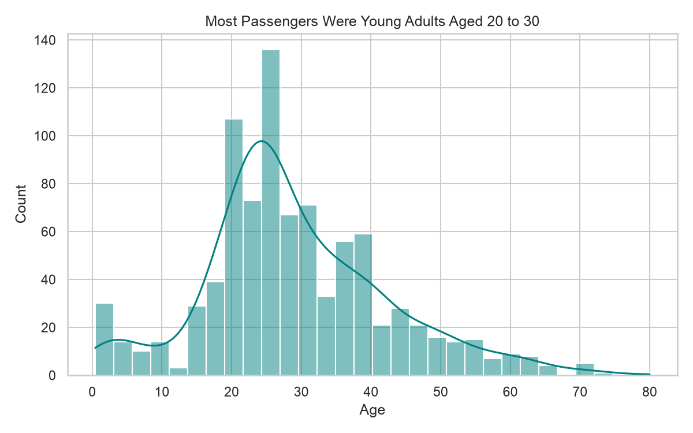
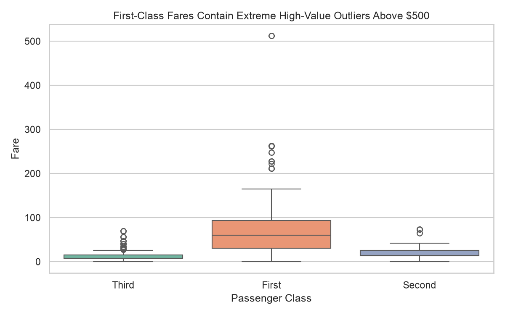
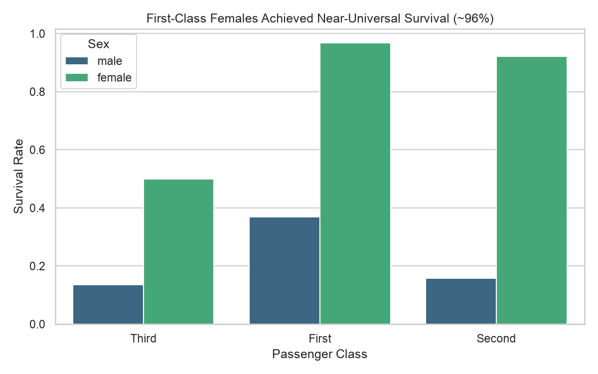
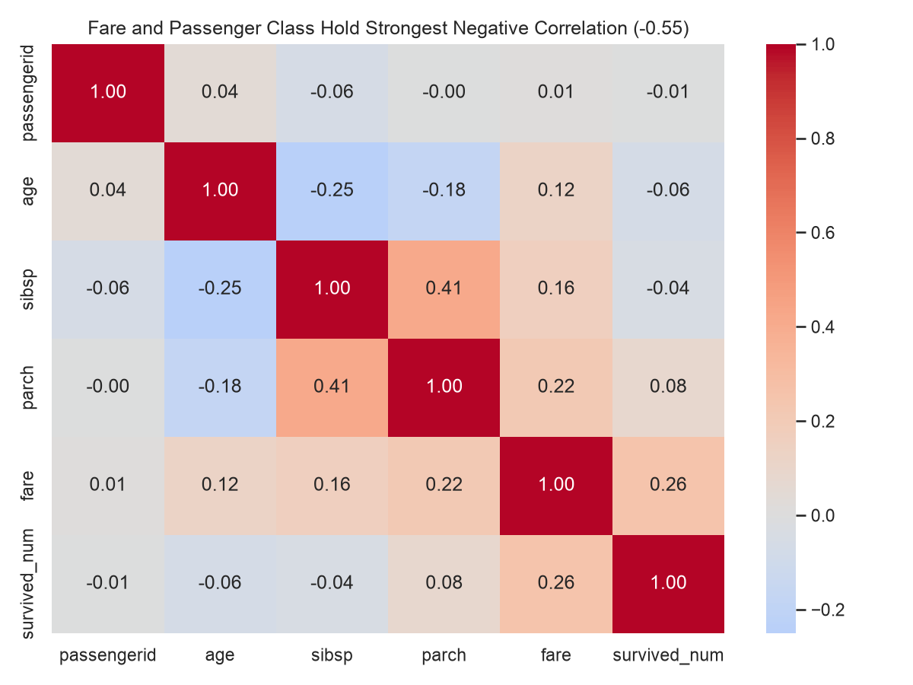
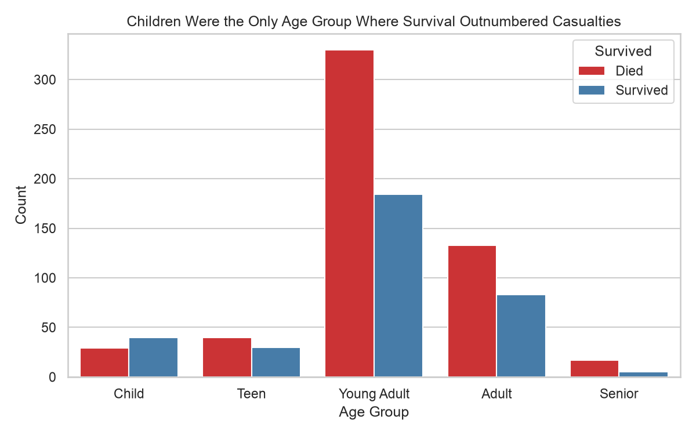
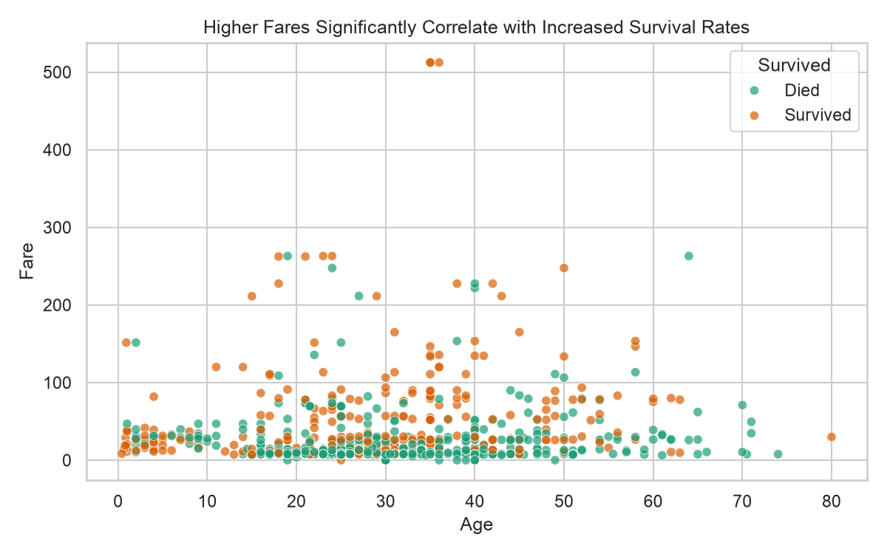
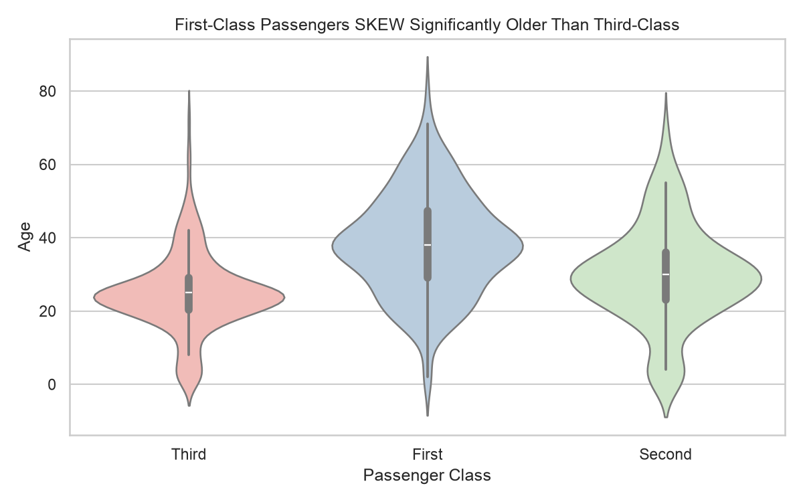
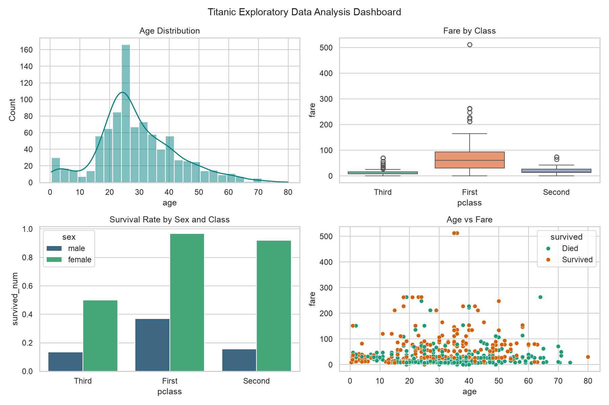

# Day 6 Data Visualization Report: Titanic Analysis

## Overview

This report presents eight data visualisations built using Matplotlib and Seaborn based on the cleaned Titanic dataset. Each plot is designed to communicate key demographic and survival trends instantly.

---

### Chart 1: Age Distribution

- **What it shows:** The overall age distribution of Titanic passengers, showing a right-skewed peak centered between ages 20 and 30, with a small secondary bump for infants and young children near age 0-5.
- **Decision/Question prompted:** This distribution prompts safety investigators to question whether lifeboat boarding priority was given specifically to infants or across all child age brackets.

---

### Chart 2: Fare Distribution across Passenger Classes

- **What it shows:** First-class fares display massive variance and extreme high-value outliers (up to $500+), whereas second and third-class fares are compressed near zero.
- **Decision/Question prompted:** Data analysts should evaluate whether extreme fare outliers need logarithmic scaling or truncation during predictive modeling to prevent model distortion.

---

### Chart 3: Survival Rate by Sex and Passenger Class

- **What it shows:** First and second-class females had near-universal survival rates (~97% and ~92%), while third-class males suffered the lowest survival rate (<15%).
- **Decision/Question prompted:** It raises the question of whether room locations closer to top decks or strict enforcement of "women and children first" had the dominant impact on survival.

---

### Chart 4: Correlation Matrix of Numerical Features

- **What it shows:** Among the numeric columns actually present in this matrix (`passengerid`, `age`, `sibsp`, `parch`, `fare`, `survived_num`), the strongest relationship is a positive correlation between `sibsp` and `parch` (+0.41), reflecting that passengers travelling with siblings/spouses also tended to travel with parents/children. `age` correlates negatively with both `sibsp` (-0.25) and `parch` (-0.18) younger passengers travelled with more family. `fare` shows the strongest link to survival (+0.26).
- **Note:** `pclass` was excluded from this matrix because it was stored as text labels (First/Second/Third) rather than a number by this point in the pipeline, so it does not appear in `df.select_dtypes(include=["number"])`. If a fare/class relationship is wanted here, `pclass` would need to be kept or re-encoded as an ordinal number (1/2/3) before this chart is built.
- **Decision/Question prompted:** Machine learning teams should check for multicollinearity between `sibsp` and `parch` before selecting feature sets for survival classification algorithms, and consider re-adding `pclass` numerically to this matrix in a future revision.

---

### Chart 5: Survival Counts across Age Groups

- **What it shows:** Children were the only demographic group where survivors outnumbered victims. Young adults made up the largest total volume of casualties.
- **Decision/Question prompted:** Historians and safety evaluators can investigate if teenage passengers were treated as adults or children during evacuation order execution.

---

### Chart 6: Age vs. Fare Paid by Survival Status

- **What it shows:** Passengers who paid higher fares (roughly above $100) survived more often than not across all ages, while casualties are heavily concentrated in the low-fare, lower part of the chart. The relationship is real but moderate fare's Pearson correlation with survival was +0.257 in the Day 5 analysis, so fare is a contributing factor rather than a dominant one on its own.
- **Decision/Question prompted:** This prompts an inquiry into whether ticket cost directly corresponded to deck accessibility and proximity to lifeboats.

---

### Chart 7: Age Distribution across Passenger Classes

- **What it shows:** First-class passengers have a higher median age (~38) and a broader distribution, whereas third-class passengers are predominantly concentrated under age 30 (median ~24).
- **Decision/Question prompted:** This raises demographic questions regarding whether third-class passengers were mostly young migrant workers and families relocating.

---

### Chart 8: Executive Summary Dashboard (2x2 Multi-Panel)

- **What it shows:** A consolidated 2x2 grid combining key insights on passenger age distribution, fare by class, class-gender survival dynamics, and the age-vs-fare scatter view.
- **Decision/Question prompted:** It allows stakeholders to quickly grasp that survival was not random, prompting immediate focus on class and gender equity in safety protocols.

---

## Conclusion: Most Informative Visualization

The single most informative visualization in this set is **Chart 3: Grouped Bar Chart of Survival Rate by Sex and Passenger Class** (`3_survival_rate_sex_pclass.png`).

**Why:** It clearly illustrates the interplay of the two strongest observable predictors of survival gender and passenger class. Within three seconds, any reader can see that first-class females had roughly 97% survival while third-class males had fewer than 15% survivors. It compresses a multi-variable interaction into a clean, intuitive, and actionable visual story, more so than any single-variable chart in the set.
