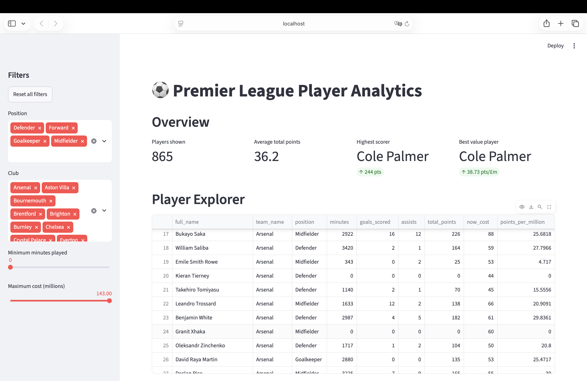
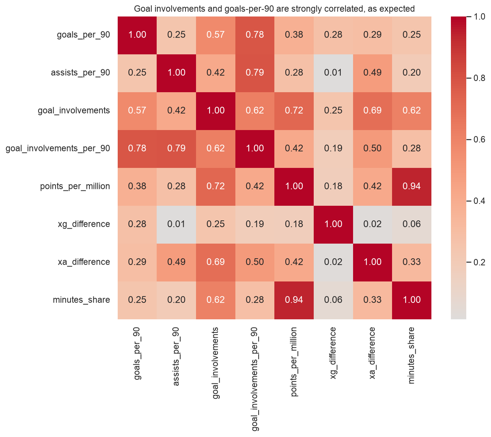
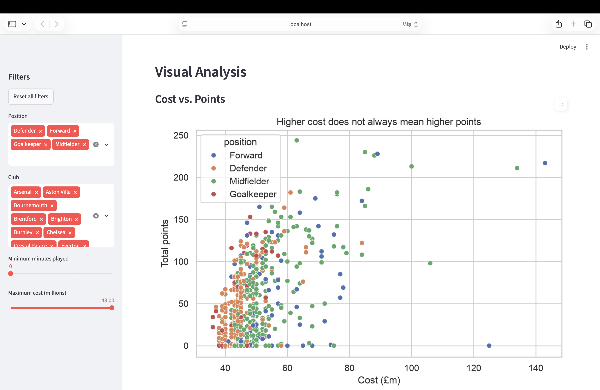
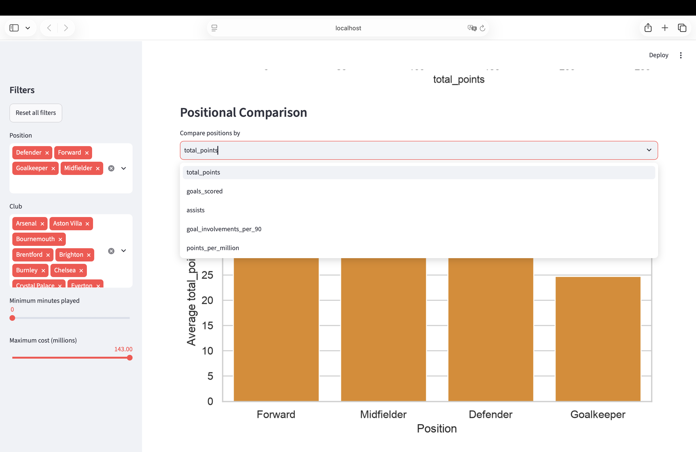

# ⚽ Premier League Player Analytics — 2023/24 Season

An end-to-end data pipeline, predictive model, and interactive dashboard analyzing real Premier League player performance data.



## Overview

Fantasy football managers and analysts face the same recurring question: which players are actually worth their price tag, and which ones are overhyped or underrated? Raw stats like "goals scored" or "cost" alone don't answer this, you need to normalize for playing time, compare players within their own position, and separate genuine skill from small-sample luck.

This project uses real 2023-24 Premier League data covering 865 players and 20 clubs, sourced from the public Fantasy Premier League dataset. The raw data arrives with 88 columns, inconsistent types, and no engineered metrics, so the first stage of this project is a full cleaning pipeline that selects the relevant columns, joins player and club data, and engineers 8 new performance metrics (like goals per 90 minutes and points per million spent).

From there, the project moves through exploratory analysis, visualization, and finally a machine learning model that predicts a player's season points from their underlying performance stats all wrapped in an interactive Streamlit dashboard so the results are usable by someone with zero coding background.

## Key Findings

**Finding 1 — Points are heavily skewed: most players contribute modestly, a small group carries the league.**
The average player scored 36.15 points, but the median was only 13, meaning a small number of high performers pull the average well above what a "typical" player actually scores (skewness of 1.45, a strong right skew).

**Finding 2 — Expensive doesn't mean valuable.**
There is zero overlap between the 10 best "points per million" players and the 10 highest-cost players in the league. The most expensive squad member isn't reliably the best pick a scout or fantasy manager optimizing purely for reputation/cost is likely leaving value on the table.


**Finding 3 — Position fundamentally changes how a player earns points.**
Forwards score via goals (0.22 goals/90 on average), midfielders balance goals and assists, and defenders/goalkeepers earn points mostly through clean sheets rather than attacking output, meaning any fair player comparison has to happen within a position, not across the whole league.

**Finding 4 — The underlying data is trustworthy: expected goals strongly predicts actual goals.**
Across all analyzed players, expected goals and actual goals scored correlate at 0.93 validating that the "expected goals" metric genuinely reflects shot quality, even though individual players still over- or under-perform their expected numbers in any given season.



**Finding 5 — Club spending efficiency varies enormously.**
Manchester City had the highest average points per player (66.65) despite Chelsea spending the most on their squad overall (£2815m) squad-wide value doesn't track simply with total spend.

## The Model

**What it predicts:** A player's total FPL points for the season, based on their in-game performance stats (minutes played, goals, assists, expected goals/assists, cost, and position) explicitly excluding any column that is mathematically derived from points itself (`bonus`, `bps`, `points_per_game`, `points_per_million`), to avoid data leakage.

**Algorithm used:** Linear Regression was selected as the final model after testing it against a Decision Tree and a tuned Random Forest with 5-fold cross-validation. Despite being the simplest of the three, it outperformed both tree-based models on every metric and was the most stable across folds.

**Performance, in plain terms:** The model explains roughly **96% of the variation** in a player's season points based on their underlying stats (cross-validated R² of 0.962), with a typical prediction error of about **6 points**. That's accurate enough to be a useful screening tool, but not precise enough to replace human scouting judgment especially for players whose points come heavily from bonus points, which the model can't fully see.

A secondary **Random Forest classifier** flags whether a player is likely to be a "high performer" (top 25% by points). It's conservative: when it says yes, it's right 100% of the time, but it misses about 18% of genuine high performers, a deliberate trade-off worth knowing if you're using it to shortlist talent (see Limitations).

## The Dashboard

An interactive Streamlit app that lets anyone explore the data without touching code:

- **Overview** — live summary metrics (player count, average points, top scorer, best-value player) that update instantly with your filters
- **Player Explorer** — a sortable, searchable table of every filtered player, with CSV export
- **Visual Analysis** — three interactive charts: cost vs. points, a user-selectable "top N players by metric" chart, and a positional comparison chart
- **Player Comparison** — pick any two players and compare their key stats side by side
- **Prediction** — enter a hypothetical player's stats and get a predicted season points total from the trained model
  
  

Run it locally with `streamlit run app.py` (see below).

## Tech Stack

| Tool                     | What it's used for                                                                                                            |
| ------------------------ | ----------------------------------------------------------------------------------------------------------------------------- |
| **pandas**               | Data loading, cleaning, joining, and aggregation                                                                              |
| **NumPy**                | Underlying numeric operations                                                                                                 |
| **matplotlib / seaborn** | Static charts for the analysis report                                                                                         |
| **scikit-learn**         | Train/test splitting, Linear Regression, Decision Tree, Random Forest, cross-validation, GridSearchCV, classification metrics |
| **Streamlit**            | The interactive dashboard                                                                                                     |
| **pathlib**              | Reliable, OS-independent file paths throughout the pipeline                                                                   |

## How to Run It

```bash
git clone https://github.com/Fawaghi24/sohail-summer-2026-fawaghi.git
cd sohail-summer-2026-fawaghi/project

# 2. Create and activate a virtual environment
python -m venv .venv
source .venv/bin/activate      # Windows: .venv\Scripts\activate

# 3. Install dependencies
pip install -r requirements.txt

# 4. Run the pipeline, in order
python src/load_data.py
python src/clean_data.py
python src/analysis.py
python src/visuals.py
python src/model.py

# 5. Launch the dashboard
streamlit run app.py
```

## Project Structure

```
project/
├── app.py                  # Streamlit dashboard — the entry point
├── requirements.txt        # All dependencies
├── data/
│   ├── raw/                # Original downloaded CSVs, never modified
│   └── processed/          # players_clean.csv, the cleaned output
├── src/
│   ├── load_data.py        # Downloads the raw player/team CSVs
│   ├── clean_data.py       # Cleaning pipeline + feature engineering
│   ├── analysis.py         # Exploratory data analysis
│   ├── visuals.py          # Generates all 8 static charts
│   └── model.py            # Trains, tunes, and evaluates the models
├── charts/                 # All generated PNG figures
├── screenshots/            # Dashboard screenshots
└── docs/
    ├── DATA_DICTIONARY.md  # Documents the 20 columns used
    └── ANALYSIS_REPORT.md  # Full written analysis report
```

## Limitations and Future Work

- **Single-season data.** All numbers reflect the 2023-24 season only. Player form, injuries, and transfers change year to year, so predictions shouldn't be assumed to hold for a future season.
- **Expected-goals is itself an estimate.** "Expected goals" is a model, not a ground truth measurement, it approximates shot quality but doesn't capture every real-world factor (e.g. weather, opponent quality on the day).
- **Fantasy points are a proxy, not a direct skill measure.** Bonus points in particular are awarded via a somewhat opaque in-game algorithm that our leakage-safe feature set can't fully reconstruct, this is the likely reason for the model's worst individual prediction errors.
- **The classifier trades recall for precision.** It's tuned to avoid false alarms, which means it's likely to under-flag genuine high performers a real risk if used for scouting purposes, where missing a good player may be costlier than a wasted look at an average one.
- **No injury, transfer, or squad-rotation context.** The model has no way to know if a player was rested, injured, or in poor form for reasons outside the stats it sees.
