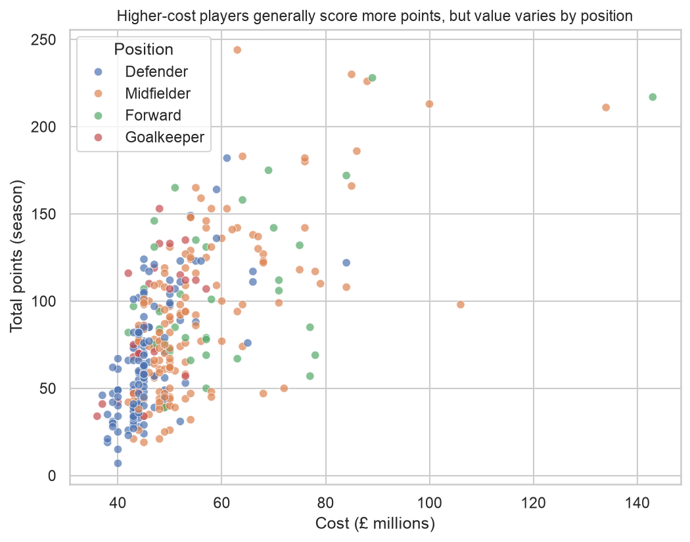
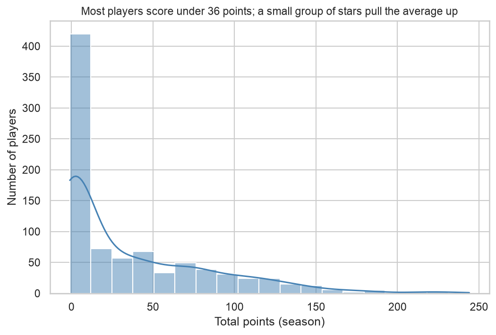
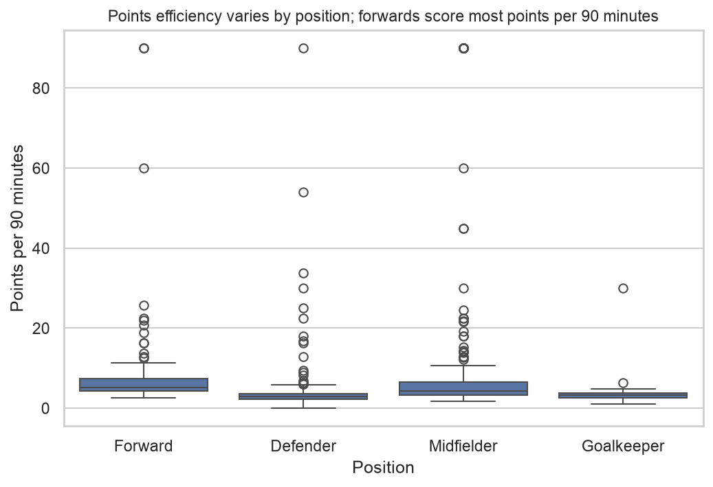
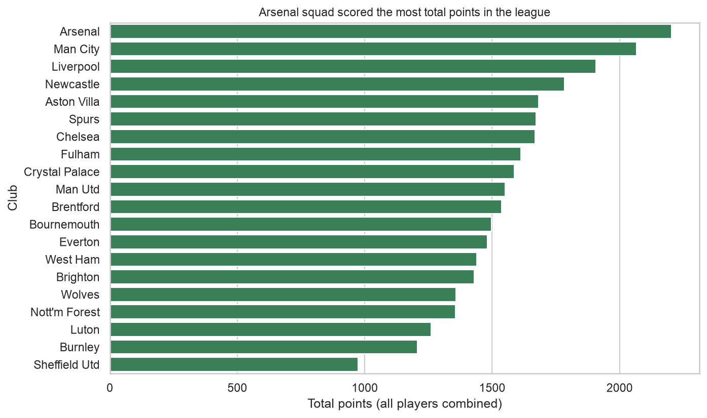
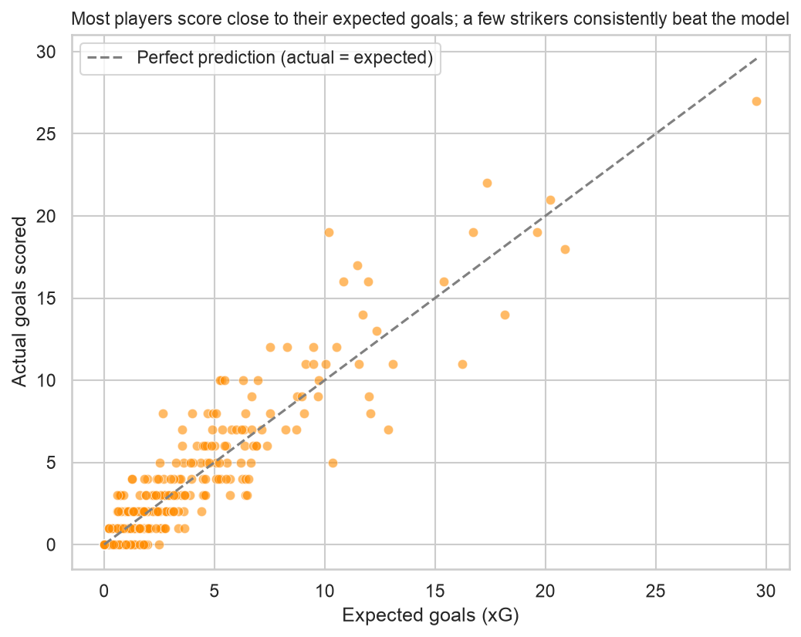
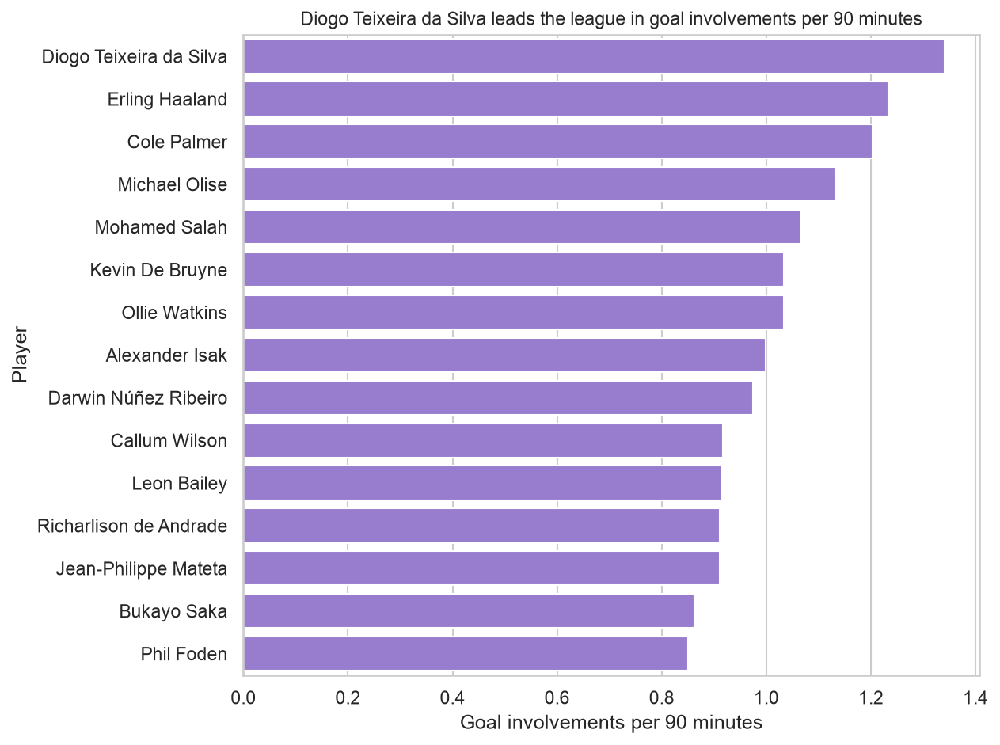

# Premier League 2023-24 Player Performance Analysis

_Sohail Smart Solutions Summer Training Programme 2026 — Capstone Project, Week 2_

## Executive Summary

- There is **zero overlap** between the 10 best "points per million" players and the 10 highest-cost players in the league, the most expensive players are consistently not the best value.
- **Manchester City** had the highest average points per player (66.65), while **Chelsea** spent the most on their squad overall (£2,815m) high spend does not translate directly into high per-player output.
- **Phil Foden** outperformed his expected goals by 8.83, the largest gap of any player in the league (10.17 xG vs 19 actual goals), a name worth watching for regression toward his underlying numbers next season.
- **Dominic Calvert-Lewin** underperformed his expected goals by -5.86 (12.86 xG vs only 7 actual goals), the biggest shortfall in the league, a potential buy-low candidate if his underlying chance quality holds up.
- Points are heavily right-skewed across the league: the average player scored 36.15 points, but the median was only 13, meaning most players scored well below the "average," and a small group of stars pulled that number up.

---

## Methodology

**Data source:** Fantasy Premier League 2023-24 season data (vaastav/Fantasy-Premier-League GitHub repository), covering 865 players across 20 clubs.

**Cleaning approach:** Raw player and team data were merged on club ID, reduced to 20 relevant columns (documented in `DATA_DICTIONARY.md`), and had text-encoded numeric fields (the expected-goals columns) corrected using `pd.to_numeric(errors="coerce")`. Eight features were engineered on top of the cleaned data: `goals_per_90`, `assists_per_90`, `goal_involvements`, `goal_involvements_per_90`, `points_per_million`, `xg_difference`, `xa_difference`, and `minutes_share`, all guarded against division-by-zero for players with 0 minutes played.

**The 900-minute threshold:** All _ranking_ analyses (top players, best value, positional comparisons, expected-goals over/underperformers) in this report only include players who played 900 or more minutes across the season, roughly 10 full matches.

_Justification:_ A player with 1 goal in 25 minutes has a per-90 rate that looks extraordinary (3.6 goal involvements per 90, as seen with M.Elneny in the raw unfiltered data), but that number reflects a single good cameo, not a repeatable skill. Filtering to 900+ minutes removes players whose stats are too noisy, driven by small sample size rather than genuine ability to trust for ranking or comparison purposes. Out of 865 total players, 339 met this threshold.

---

## Findings

### Finding 1: Expensive players are not reliably the best value

**Finding:** There is no overlap at all between the top 10 players by points-per-million and the top 10 highest-cost players in the league.

**Evidence:** Cole Palmer led points-per-million at 38.73 (cost £6.3m, 244 points), while the most expensive player, Erling Haaland (£14.3m), does not appear in the value top 10 at all despite scoring well (217 points) his high cost outweighs his output ratio.

**Interpretation:** Clubs or fantasy managers optimizing purely for reputation or price are very likely leaving value on the table. The players offering the best return relative to cost are frequently mid-priced rather than the marquee names.

**Caveat:** Points-per-million rewards consistent output relative to price, but says nothing about ceiling a cheap, efficient player is not necessarily a better _overall_ talent than an expensive one; they simply return more points for the money spent.

---

### Finding 2: Points are heavily skewed toward a small group of standout performers

**Finding:** The distribution of total points across the league is strongly right-skewed, meaning a small number of high scorers pull the average well above what a typical player earns.

**Evidence:** Mean total points = 36.15, median = 13.00, skewness = 1.45. The top scorer, Cole Palmer, earned 244 points nearly 7 times the league median.

**Interpretation:** Most players in the dataset (including many low-minute squad players) contribute modestly, while a small elite tier mostly attacking midfielders and forwards accounts for a disproportionate share of total points.

**Caveat:** This includes all 865 players, regardless of minutes played, so part of the skew reflects players who barely featured, not just genuine performance variation among regular starters.

---

### Finding 3: Position fundamentally changes how a player earns points

**Finding:** Forwards score points mainly through goals, midfielders balance goals and assists, and defenders/goalkeepers earn points primarily through other means (clean sheets), not attacking output.

**Evidence:** Average goals per 90 by position: Forwards 0.22, Midfielders 0.11, Defenders 0.03, Goalkeepers 0.00. Average total points, however, is closest between Forwards (40.12) and Midfielders (40.01), despite the large gap in scoring rate midfielders make up the difference through assists (0.12 per 90, the highest of any position) and volume.

**Interpretation:** Any fair player comparison for value analysis, scouting, or fantasy selection has to happen within a position group. Comparing a goalkeeper's goal tally to a forward's is meaningless.

**Caveat:** This analysis doesn't account for a defender's clean-sheet bonus points directly in the goals/assists breakdown shown here, so defenders' true point-scoring pathway is likely underrepresented by these two metrics alone.

---

### Finding 4: Manchester City are the most efficient squad in the league, not the most expensive

**Finding:** Manchester City had the highest average points per player of any club, while Chelsea had the highest total squad spend the two are not the same club.

**Evidence:** Man City: 66.65 average points per player (2,066 total points, 31 players). Chelsea: 28.27 average points per player (1,668 total points, 59 players), while also having the highest total squad cost at £2,815m.

**Interpretation:** Squad-wide efficiency doesn't scale simply with money spent Chelsea fielded a much larger squad (59 players used across the season) at a higher total cost, but with lower average output per player than a more settled, higher-performing City squad.

**Caveat:** A larger squad size naturally dilutes average points per player (more rotation, more fringe players featuring), so this comparison partly reflects squad management style, not just player quality.

---

### Finding 5: A handful of players significantly outperform or underperform their expected goals

**Finding:** Phil Foden was the league's biggest overperformer relative to expected goals; Dominic Calvert-Lewin was the biggest underperformer.

**Evidence:** Foden: 10.17 xG, 19 actual goals (+8.83 difference). Calvert-Lewin: 12.86 xG, 7 actual goals (−5.86 difference). Across all 339 filtered players, expected goals and actual goals correlate strongly at 0.93.

**Interpretation:** The strong overall correlation confirms xG is a broadly reliable measure of chance quality. Individual large gaps in either direction are the interesting exceptions: they may reflect genuine clinical finishing (or its opposite), or short-term luck that is likely to regress toward the underlying expected rate in future seasons.

**Caveat:** A single season isn't enough to say definitively whether Foden's overperformance is a repeatable skill or a hot streak, this would need multi-season data to properly separate signal from noise.

---

### Finding 6: Goal involvement leaders are dominated by attacking midfielders, once minutes are properly filtered

**Finding:** When ranked fairly (900+ minutes), the league's top players by goal involvements per 90 are led by attacking midfielders and forwards, not the small-sample outliers that top the unfiltered list.

**Evidence:** Filtered leader: Diogo Jota (Liverpool), 1.34 goal involvements per 90 across 1,141 minutes. The unfiltered "leader" was M.Elneny at 3.6 per 90 built entirely from a single goal involvement in just 25 minutes.

**Interpretation:** This is the clearest demonstration in the whole analysis of why the minutes threshold matters: the unfiltered ranking is dominated by statistical noise, not genuine ability.

**Caveat:** Even the 900-minute threshold is a judgment call, not a hard scientific cutoff, a different threshold (say, 1,500 minutes) could shift this exact ranking somewhat.

---

## The Sample Size Effect

**Top 5 by goal involvements per 90 no minutes filter:**

| Player       | Minutes | Goal Involvements per 90 |
| ------------ | ------- | ------------------------ |
| M.Elneny     | 25      | 3.60                     |
| Earthy       | 33      | 2.73                     |
| Veliz        | 45      | 2.00                     |
| Sergio Gómez | 48      | 1.88                     |
| Enes Ünal    | 317     | 1.70                     |

**Top 5 by goal involvements per 90 — 900+ minute filter applied:**

| Player         | Minutes | Goal Involvements per 90 |
| -------------- | ------- | ------------------------ |
| Diogo Jota     | 1,141   | 1.34                     |
| Erling Haaland | 2,553   | 1.23                     |
| Cole Palmer    | 2,617   | 1.20                     |
| Michael Olise  | 1,272   | 1.13                     |
| Mohamed Salah  | 2,531   | 1.07                     |

**What this comparison demonstrates:** The unfiltered list is built almost entirely from tiny samples several of these players had a single productive substitute appearance and nothing else to their name that season. Once the 900-minute threshold is applied, the list changes completely and becomes recognizable, consistent attacking talent (Haaland, Palmer, Salah). This is the core lesson of sample size: extreme-looking rates from small samples are usually noise, not signal, and any serious ranking has to filter them out before drawing conclusions.

---

## Limitations

- **Single-season data.** This analysis reflects only the 2023-24 season. Player performance varies year to year due to injuries, transfers, team changes, and natural variance, conclusions here should not be treated as permanent judgments of a player's ability.
- **Expected-goals (xG) models are themselves estimates**, not ground truth. They are built from historical averages of similar shots, so a player's "true" finishing skill can differ from what xG suggests, in either direction.
- **Fantasy points are a proxy for performance, not a direct measure of it.** They're influenced by the FPL scoring system's specific rules (bonus points, clean-sheet bonuses for defenders, etc.), which don't always align with a player's real footballing value.
- **Squad size differences distort club-level averages.** Clubs that used more players across the season (due to rotation or injuries) will naturally show a lower average points-per-player than a club with a settled starting XI, independent of actual squad quality.

---

_Data source: Fantasy Premier League 2023-24 dataset (vaastav/Fantasy-Premier-League). Built during the Sohail Smart Solutions Summer Training Programme 2026._
